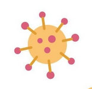

 <a href="https://www.conicet.gov.ar/wp-content/uploads/EBTs_ESP_PREVIEW.pdf"><strong>1. En los últimos años se han fundado más de 50 empresas de base tecnológica</strong></a> en coordinación con CONICET o fundadas/dirigidas por investigadores de CONICET. Estas empresas participan en diversas áreas de la economía nacional: petróleo, biotecnología, medicina de precisión y desarrollo de nuevos herbicidas e insecticidas ecológicos para la producción agrícola.

 <a href="https://www.argentina.gob.ar/cnea/carem"><strong>2. Reactor Modular CAREM</strong></a>. El CAREM es un reactor modular pequeño, 100% argentino, diseñado por la CNEA y con un 85% de avance en su construcción, posicionado como uno de los cuatro desarrollos más avanzados de este tipo a nivel mundial, junto a proyectos de China, EEUU y Rusia.

 <a href="https://www.rosario-conicet.gov.ar/ver-noticias/item/930-desarrollan-una-nueva-variedad-de-soja-que-posee-vainas-de-cuatro-semillas"><strong>3. Desarrollo de una nueva variedad de soja denominada Tango 4S</strong></a>. Científicos del Instituto de Investigaciones en Ciencias Agrarias de Rosario (IICAR, CONICET-UNR) crearon una nueva variedad de soja cuya principal característica es que el 60% de sus vainas contienen cuatro semillas en lugar de tres.

 <a href="https://www.conicet.gov.ar/danone-presenta-la-nueva-receta-de-yogurisimo-con-tecnologia-del-conicet-que-contribuye-a-la-salud-respiratoria-y-gastrointestinal/"><strong>4. Yogur con probióticos</strong></a>. Danone saca al mercado un nuevo yogur con probióticos aislados y estudiados por especialistas del CONICET que mejoran la salud respiratoria y gastrointestinal. Los mismos investigadores desarrollaron <a href="https://www.rosario3.com/noticias/Llego-Yogurito-para-combatir-la-desnutricion-infantil-20120111-0029.html">Yogurito</a>, un producto que se utilizó para combatir la desnutrición infantil.

 <a href="https://unr.edu.ar/ciencia-por-la-memoria/#:~:text=El%20trabajo%20de%20antrop%C3%B3logos%2C%20arque%C3%B3logos,la%20%C3%BAltima%20dictadura%20c%C3%ADvico%20militar"><strong>5. El aporte de la ciencia forense a la memoria, la verdad y la justicia</strong></a>. Investigaciones llevadas a cabo por el Equipo Argentino de Antropología Forense (EAAF), contribuyen con la identificación y restitución de cuerpos de personas desaparecidas, y con la recuperación de nietos nacidos en cautiverio y apropiados durante la última dictadura cívico-militar.

 <a href="https://www.conicet.gov.ar/litio-un-centro-del-conicet-sera-el-unico-en-argentina-en-producir-un-elemento-clave-para-la-fabricacion-de-baterias/"><strong>6. Litio: un centro del CONICET será el único en Argentina en producir un elemento clave para la fabricación de baterías.</strong></a> Es el flúor, un gas altamente reactivo capaz de secar la humedad del electrolito que les provee la carga eléctrica, garantizando su vida útil y condiciones de seguridad.

 <a href="https://ceve.org.ar/ladrillos-bloques/"><strong>7. Ecoladrillos del CEVE</strong></a>. Investigadores del CEVE-CONICET desarrollaron ladrillos hechos de residuos plásticos, abaratando costos y reduciendo la contaminación, además de ser mejor aislante térmico que los ladrillos de barro.

 <a href="https://cordoba.conicet.gov.ar/presentan-electrolizador-para-la-produccion-de-hidrogeno-verde/"><strong>8. Desarrollo de un electrolizador para la producción de hidrógeno verde</strong></a>. Se diseñó, construyó e instaló un electrolizador alcalino de 5 kW de potencia. El hidrógeno verde es de enorme importancia en la industria, ya que permitiría descarbonizar variados procesos productivos. Desarrollo de investigadores CONICET en cooperación con la empresa Fluorita Córdoba SRL.

 <a href="https://www.conicet.gov.ar/investigadores-del-conicet-descifraron-el-genoma-completo-del-malbec/"><strong>9. Secuenciación del genoma completo de la uva Malbec</strong></a>. Permitirá el desarrollo de cepas más adaptables y mejoras en la calidad de este varietal insignia.

 <a href="https://www.arsat.com.ar/satelites-geoestacionarios-de-telecomunicaciones/"><strong>10. Satélites geoestacionarios de comunicaciones.</strong></a> ARSAT opera los satélites ARSAT-1 y ARSAT-2, construídos por INVAP. El satélite ARSAT-1 fue lanzado en 2014 y transmite en banda KU, prestando servicios de telefonía, datos y televisión, con cobertura en el cono sur. El satélite ARSAT-2 fue lanzado en 2015 y transmite en banda KU y banda C con cobertura en todo el continente americano. Ofrece servicio de transporte de datos y video.

 <a href="https://www.sciencedirect.com/science/article/abs/pii/S0360319914008490"><strong>11. Capacidades de Argentina para producir hidrógeno renovable.</strong></a> Investigadores de CONICET analizaron las capacidades del país para producir hidrógeno con energías renovables.

 <a href="https://www.argentina.gob.ar/noticias/que-beneficios-aporta-el-queso-con-fitoesteroles-y-antioxidantes-naturales-0"><strong>12. Queso que ayuda a reducir el colesterol.</strong></a> El INTA, junto a la empresa cordobesa Lácteos Capilla del Señor, desarrolló el primer queso de la Argentina que ayuda a reducir el colesterol y que aporta, por porción, un 30% de los requerimientos diarios de vitamina E.

 <a href="https://www.conicet.gov.ar/un-desarrollo-de-un-equipo-de-investigacion-del-conicet-permite-la-desalinizacion-del-agua-de-mar-para-consumo-humano/"><strong>13. Un desarrollo de un equipo de investigación del CONICET permite la desalinización del agua de mar para consumo humano.</strong></a> El equipamiento trabaja con hidrógeno verde en un circuito que no produce impacto ambiental.

 <a href="https://www.argentina.gob.ar/sites/default/files/estudios_sobre_condiciones_de_vida.pdf"><strong>14. Estudio sobre las condiciones de vida de la población argentina</strong></a>. Este estudio enmarcado en el proyecto PISAC será clave para abordar las problemáticas sociales relacionadas a pobreza, salud, bienestar, medioambiente y seguridad social.

 <a href="https://www.conicet.gov.ar/el-conicet-fue-parte-del-desarrollo-del-segundo-magnetometro-criogeno-del-mundo-clave-para-la-industria-petrolera/"><strong>15. Desarrollo del segundo magnetómetro criogénico del mundo</strong></a>, clave para la industria petrolera. Es un equipo capaz de medir el paleomagnetismo en rocas en la exploración de hidrocarburos. Desarrollo conjunto entre CONICET, la CNEA y la empresa Endeavour Ingeniería.

 <a href="https://www.argentina.gob.ar/noticias/el-inta-logro-secuenciar-el-genoma-de-la-chicharrita-del-maiz-1"><strong>16. Secuenciación del genoma de la chicharrita del maíz</strong></a>, lo que podría permitir el diseño de estrategias más precisas y dirigidas para controlar a esta plaga que afecta los cultivos y genera grandes pérdidas económicas.

 <a href="https://www.agenciacyta.org.ar/2024/10/la-anmat-aprobo-el-primer-test-nacional-de-antigeno-para-el-diagnostico-de-dengue/"><strong>17. Aprobación por la ANMAT del kit Detect-AR Dengue TEST de ELISA NS1</strong></a>, el primer test de antígeno nacional para el diagnóstico de cualquiera de los cuatro serotipos del dengue.

 <a href="https://www.conicet.gov.ar/investigadores-del-conicet-reconocidos-por-la-academia-nacional-de-ciencias-exactas-fisicas-y-naturales-2/"><strong>18. Premio por la fabricación nacional de tubos de circonio</strong></a> que alojan los elementos combustibles para la fisión del uranio, lo que permitió extender la vida útil de la Central Nuclear Embalse.

 <a href="https://idacor.conicet.gov.ar/tenemos-nuestra-sangre-en-este-lugar/"><strong>19. Las ciencias sociales y humanas contribuyen con el cumplimiento de derechos indígenas.</strong></a> Investigadores/as del CONICET y la UNC fueron parte de un equipo que ofreció evidencias en una Audiencia Pública sobre el derecho a la identidad, la autodeterminación, la ocupación y la titularidad de territorios ancestrales de la Comunidad Comechingona Pluma Blanca, logrando la suspensión de su desalojo en 2022.

 <a href="https://www.conicet.gov.ar/neokit-la-empresa-del-conicet-que-crea-test-simples-y-economicos-para-detectar-numerosas-enfermedades/"><strong>20. Neokit: la empresa del CONICET que crea test simples y económicos para detectar numerosas enfermedades</strong></a>. Dengue, Chagas, viruela de mono, chikunguña y Covid son algunas de las patologías que se pueden identificar en solo 1 hora a través de sus productos.

 <a href="https://nexciencia.exactas.uba.ar/murcielagos-rabia-clasificacion-mapa-generos-argentina-diego-caraballo"><strong>21. Armado del mapa de la distribución de los géneros de murciélagos que impulsan la transmisión del virus de la rabia</strong></a> en la Argentina y en América, el único continente en el mundo donde estos mamíferos son reservorios de la enfermedad.

 <a href="https://nexciencia.exactas.uba.ar/desarrollan-metodo-detectar-huellas-dactilares-latentes-economico-no-destructivo-luz-polarizada-emanuel-chironi-claudio-iemmi"><strong>22. Desarrollo de un método económico que usa luz polarizada para revelar huellas dactilares</strong></a> que no son visibles a simple vista, sin contaminar ni destruir el objeto que puede servir de prueba.

 <a href="https://www.conicet.gov.ar/65342-2/"><strong>23. Software para medir la movilidad de los espermatozoides</strong></a>. Científicos del CONICET Mar del Plata y de la Universidad Nacional de Mar del Plata, en conjunto con investigadores de España.

 <a href="https://www.argentina.gob.ar/noticias/presentacion-de-los-resultados-de-la-convocatoria-pisac-covid-19"><strong>24. El PISAC-COVID19 permitió monitorear en tiempo real la evolución de la sociedad argentina durante la pandemia y postpandemia</strong></a>, analizando el impacto de las políticas en los territorios (como IFE y ATP), transformaciones en el mundo del trabajo, la educación y las tareas de cuidados entre otros. Además, se construyeron redes federales de investigación y repositorios de consulta abierta con la información recogida.

 <a href="https://www.conicet.gov.ar/un-estudio-genetico-logro-determinar-las-ancestrias-presentes-en-el-adn-de-los-argentinos/"><strong>25. Un estudio genético encabezado por científicos del CONICET La Plata logró determinar las ancestrías presentes en el ADN de los argentinos</strong></a>. El trabajo brinda información precisa sobre los niveles de influencia europea, africana y nativa en la estructura de la población actual.

 <a href="https://nordeste.conicet.gov.ar/avanza-el-proyecto-internacional-para-la-produccion-de-bioplasticos-nanocelulosa-y-biocompuestos-de-residuos-forestales/"><strong>26. El proyecto internacional ValBio-3D</strong></a>. Desarrollo de tecnologías eficientes para la producción de biomateriales, integrando bioplásticos y nanocelulosas a partir de residuos de ingenios y aserraderos. El objetivo es obtener materiales sustentables y biodegradables, compatibles con el concepto de la bioeconomía.

 <a href="https://www.conicet.gov.ar/cientificas-del-conicet-lograron-un-producto-antimicrobiano-con-yerba/"><strong>27. Científicas del CONICET La Plata lograron un producto antimicrobiano con yerba.</strong></a> Tras hacer ensayos con el residuo del mate, comprobaron la inhibición del crecimiento de dos bacterias perjudiciales para la salud humana.

 <a href="https://nordeste.conicet.gov.ar/el-trabajo-de-una-investigadora-del-conicet-clave-para-el-juicio-por-una-masacre-indigena-en-el-chaco/"><strong>28. Aporte de evidencia al juicio por la Masacre de Napalpí</strong></a>. Una investigación realizada por una científica del CONICET aportó evidencia en el proceso del juicio por la Masacre de Napalpí, que en 2022 reconoció la responsabilidad estatal en el genocidio de pueblos indígena y declaró sus acciones como crímenes de lesa humanidad.

 <a href="https://noticias.unsam.edu.ar/2021/03/29/superbarbijos-la-historia-detras-del-primer-producto-masivo-de-la-unsam-la-uba-y-el-conicet/"><strong>29. El Barbijo de CONICET</strong></a>. En plena pandemia de COVID-19, aplicando conocimientos de nanotecnología y materiales, se desarrolló un barbijo innovador que se sigue mejorando.

 <a href="https://www.conicet.gov.ar/hallan-las-primeras-evidencias-prehispanicas-de-lepra-en-america/"><strong>30. El secuenciamiento de genomas bacterianos de entre 4000 y 5000 años de antigüedad</strong></a> permitió identificar la presencia de enfermedades como las <a href="https://www.conicet.gov.ar/revelan-claves-sobre-el-origen-y-la-expansion-de-la-sifilis-en-america-y-el-resto-del-mundo/">treponematosis</a>, la tuberculosis y la <a href="https://www.conicet.gov.ar/hallan-las-primeras-evidencias-prehispanicas-de-lepra-en-america/">lepra</a> en el pasado, y analizar los cambios que presentan las variantes actuales de estos patógenos. Estos estudios son fundamentales para comprender la evolución de las enfermedades y sus impactos en las poblaciones humanas.

 <a href="https://www.conicet.gov.ar/develan-misterio-sobre-el-funcionamiento-de-un-grupo-de-celulas-inmunologicas-que-promueve-el-desarrollo-de-tumores/"><strong>31. Descubrimiento del desarrollo de tumores mieloides</strong></a>: Científicos del CONICET ayudaron a descifrar los mecanismos de acción de las células mieloides supresoras. Propusieron una posible estrategia terapéutica para re-programarlas y que colaboren a combatir el cáncer.

 <a href="https://www.conicet.gov.ar/cientificos-argentinos-realizan-descubrimiento-clave-para-aumentar-el-rendimiento-del-trigo/"><strong>32. El mejoramiento genético del trigo que mejoraría rendimientos</strong></a>: Identificaron una región genómica asociada con la fertilidad de la espiga que podría servir como blanco para estrategias de mejoramiento genético del cultivo.

 <a href="https://www.conicet.gov.ar/genomap-la-startup-reconocida-por-el-conicet-que-brinda-servicios-de-analisis-bioinformaticos-para-realizar-diagnosticos-geneticos-personalizados/"><strong>33. Investigadores de CONICET fundan una empresa bioinformática que realiza diagnósticos genéticos personalizados:</strong></a> Un servicio clave para diseñar tratamientos más apropiados para cada paciente, lo que se llama medicina personalizada.

 <a href="https://www.conicet.gov.ar/tecnologia-desarrollada-por-investigadores-del-conicet-logra-aumentar-tasas-de-exito-de-reproduccion-asistida-en-estudios-preclinicos-y-clinicos/"><strong>34. Tecnología desarrollada por investigadores del CONICET logra aumentar tasas de éxito de reproducción asistida</strong></a>: La tecnología *HyperSperm* reproduce *in vitro* los mismos cambios bioquímicos que experimentan los espermatozoides de forma natural en el tracto reproductivo femenino antes de la fecundación. Estudios preclínicos y clínicos demostraron su seguridad y eficacia y se espera cumplimentar las etapas regulatorias para estar en el mercado para 2026-2027.

 <a href="https://revistas.unlp.edu.ar/CTyP/article/download/13808/12827/50744?inline=1#:~:text=El%20segundo%20ten%C3%ADa%20como%20objetivos,segunda%20convocatoria%20del%20PISAC%20II"><strong>35. El Programa de Investigación sobre la Sociedad Argentina (PISAC) permitió tomar decisiones de políticas públicas basadas en evidencia</strong></a>. Su objetivo fue contribuir a la toma de decisiones de política pública con conocimientos valiosos acerca de cómo viven, piensan y actúan los argentinos, del cual resultaron importantes volúmenes con información de las viviendas, alimentación, acceso al crédito, educación y salud de la población, etc.

 <a href="https://www.conicet.gov.ar/especialistas-del-conicet-identifican-una-prometedora-alternativa-terapeutica-contra-el-chagas-cronico/"><strong>36. Prometedora alternativa terapéutica contra el Chagas crónico</strong></a>. El estudio *in vitro* indica que un fármaco que se emplea para el tratamiento de ciertos tipos de cáncer se podría reposicionar para combatir esta patología.

 <a href="https://ri.conicet.gov.ar/handle/11336/246078"><strong>37. Sobre la sociedad del conocimiento, plataformas digitales y ciudades</strong></a>. Se examinan las maneras en las que la utilización de plataformas digitales modifica los usos del espacio urbano, los tiempos sociales, las formas de residencia, el turismo, las apropiaciones sociales del espacio público y la vida urbana cotidiana.

 <a href="https://www.conicet.gov.ar/investigadores-e-investigadoras-del-conicet-trabajan-en-una-empresa-de-base-tecnologica-para-cultivar-erizos-de-mar/"><strong>38. Investigadores e investigadoras del CONICET trabajan en una Empresa de Base Tecnológica para cultivar erizos de mar.</strong></a> La planta piloto a escala industrial tiene como objetivo desarrollar un sistema de cultivo de huevos de erizos de mar con bienestar animal a partir de biotecnología, para que puedan ser utilizados en suplementos dietarios. La EBT fue creada en el seno del CCT CENPAT.

 <a href="https://www.conicet.gov.ar/investigadores-del-conicet-trabajan-en-la-digitalizacion-del-archivo-general-de-la-nacion/"><strong>39. Digitalización de una de las fuentes documentales más importantes del país:</strong></a> Digitalización del Archivo General de la Nación.

 <a href="https://intainforma.inta.gob.ar/se-presento-la-primera-avena-apta-celiacos-de-la-argentina/"><strong>40. Avena apta para celíacos</strong></a>: luego de 15 años de investigación, investigadores del INTA desarrollaron YAPA, una variedad de avena que se cultiva a campo en condiciones controladas para abastecer la producción de la línea de cosméticos Aveno de los Laboratorios Andrómaco.

 <a href="https://www.conicet.gov.ar/revelan-un-nuevo-blanco-terapeutico-para-el-tratamiento-de-canceres-de-sangre/"><strong>41. Identificación del rol clave de la proteína galectina-1 (Gal-1) en la progresión de la mielofibrosis</strong></a>, un tipo de cáncer de sangre, lo que habilitaría estrategias en el futuro para frenar su avance.

 <a href="https://www.scielo.org.mx/scielo.php?script=sci_arttext_plus&pid=S2395-91692023000100118&lng=es&tlng=es&nrm=iso"><strong>42. Aportes teóricos a partir de estudios situados en la ciudad de Córdoba que posibilitan comprender la problemática del hambre</strong></a> en los sectores populares y el papel central de las mujeres en el trabajo de cuidado comunitario para repensar las políticas públicas vigentes.

 <a href="https://intainforma.inta.gob.ar/el-inta-es-referente-en-la-gestion-de-alergenos-alimentarios/"><strong>43. Alergias provocadas por alimentos</strong></a>. El INTA coordina un espacio multidisciplinario que reúne a investigadores, médicos, organismos de control, industria alimenticia y grupos de pacientes donde se investiga y se generan desarrollos con el objetivo de proteger a quienes sufren alergias alimentarias.

 <a href="https://intainforma.inta.gob.ar/en-la-argentina-hay-mas-de-400-tambos-robotizados-en-funcionamiento/"><strong>44. Tambos robotizados.</strong></a> En la Argentina, hay más de 400 tambos robotizados, un sistema de ordeño que utiliza robots para realizar el proceso de forma autónoma y permite que las vacas se ordeñen a su propio ritmo. Esta técnica fue desarrollada por el INTA y la empresa DeLaval.

 <a href="https://intainforma.inta.gob.ar/avanzan-en-el-desarrollo-de-una-nueva-vacuna-contra-el-virus-de-la-fiebre-aftosa/"><strong>45. Nueva vacuna contra el virus de la fiebre aftosa</strong></a>. El INTA, el National Research Council Canadá (NRCC) y Bioinnovo –empresa de base tecnológica conformada por el INTA y Vetanco SA– trabajan con la <a href="https://intainforma.inta.gob.ar/avanzan-en-el-desarrollo-de-una-nueva-vacuna-contra-el-virus-de-la-fiebre-aftosa/">primera vacuna contra el virus</a> de la <a href="https://www.woah.org/es/enfermedad/fiebre-aftosa/">fiebre aftosa</a> que no utiliza material infectivo en su elaboración. Se trata de un hito de relevancia mundial.

 <a href="https://www.fcq.unc.edu.ar/metodo-computacional-desarrollado-en-fcq-obtuvo-el-primer-puesto-ante-proyectos-basados-en-ia-como-el-actual-premio-nobel-de-quimica/"><strong>46. Premio en competencia internacional al método computacional 2Vinardo que predice estructuras de complejos moleculares</strong></a> entre proteínas y fármacos, desarrollado con la combinación de métodos tradicionales e inteligencia artificial y que podría utilizarse para el diseño de nuevos medicamentos.

 <a href="https://www.conicet.gov.ar/cientificos-del-conicet-prestan-un-servicio-tecnologico-para-revalorizar-residuos-organicos-de-la-industria-alimentaria/"><strong>47. Científicos del CONICET prestan un servicio tecnológico para revalorizar residuos orgánicos de la industria alimentaria.</strong></a> Está destinado a empresas del sector que deseen evaluar el potencial de convertir sus desechos en diversos productos de alto valor agregado, mediante su tratamiento con larvas de Mosca Soldado Negra.

 <a href="https://www.conicet.gov.ar/el-camino-de-un-cientifico-que-fundo-la-empresas-de-base-tecnologica-que-exporta-enzimas-al-mundo/"><strong>48. Un científico fundó una empresa de Base Tecnológica que exporta enzimas al mundo.</strong></a> Hugo Menzella uno de los fundadores de Keclon, dedicada a brindar soluciones biotecnológicas a problemas de diversas industrias.

 <a href="https://www.conicet.gov.ar/desarrollan-recubrimientos-de-semillas-para-favorecer-la-productividad-de-los-cultivos/"><strong>49. Desarrollan recubrimientos de semillas para favorecer la productividad de los cultivos</strong></a>. El proyecto, encabezado por una científica del CONICET y el INTA, apuesta a formular una serie de polímeros naturales, biodegradables y de bajo costo que puedan vehiculizar insumos agronómicos, tanto químicos como biológicos.

 <a href="https://cordoba.conicet.gov.ar/investigadores-desarrollan-un-dispositivo-innovador-para-optimizar-el-funcionamiento-de-bicicletas-electricas/"><strong>50. Investigadores desarrollan un dispositivo innovador para optimizar el funcionamiento de bicicletas eléctricas.</strong></a> Esta innovación tecnológica mejora el control de motores eléctricos y proyecta su impacto en la industria.

 <a href="https://argentina.unfpa.org/es/publications/el-derecho-la-educaci%C3%B3n-sexual-integral-en-la-argentina-aprendizajes-de-una-experiencia%20"><strong>51. Aportes a la implementación de políticas públicas destinadas a garantizar los derechos de niñeces, adolescencias y juventudes</strong></a>, mediante la producción de conocimientos que analizan obstáculos y resistencias, identifican condiciones de posibilidad y ofrecen insumos estratégicos para la efectivización del plexo normativo de ampliación de derechos.

 <a href="https://www.conicet.gov.ar/logran-optimizar-en-ensayos-in-vivo-una-terapia-disponible-para-tratar-la-atrofia-muscular-espinal/"><strong>52. Optimización de terapia para atrofia muscular espinal.</strong></a> Una investigación de científicos del CONICET sugiere que los resultados del tratamiento con nusinersen podrían optimizarse si se combinan con la administración de ácido valproico.

 <a href="https://www.inti.gob.ar/hechoeninti/flores-norpatagonicas"><strong>53. Harina de rosa mosqueta</strong></a>. Una empresa familiar, fabricante de cosméticos a partir de rosa mosqueta, decidió innovar y darle valor agregado a los desechos de este fruto y así comenzó a producir harina de rosa mosqueta, ahora inscripta en el Código Alimentario Argentino, gracias a la asistencia técnica del INTI.

 <a href="https://www.inti.gob.ar/noticias/19-servicios-industriales/1438-indumentaria-segura-para-combatir-incendios"><strong>54. Trajes de bomberos</strong></a>. Especialistas del laboratorio textil del INTI brindaron asistencia técnica a una empresa en todos los procesos previos a la certificación de indumentaria de protección térmica e ignífuga para bomberos. Entre los ensayos, se realizaron pruebas de transferencia térmica y comportamiento al fuego de los diferentes tejidos del traje.

 <a href="https://www.inti.gob.ar/noticias/15-desarrollo-e-innovacion/1424-valor-agregado-para-una-cadena-de-carnicerias"><strong>55. Carne lista para cocinar</strong></a>. Una importante carnicería trabajó junto al INTI en el desarrollo de un producto listo para la venta como carne cruda cortada a cuchillo ya marinada con hierbas, preparada para agregar a la sartén o al horno. Otros desarrollos pueden leerse <a href="https://www.inti.gob.ar/hechoeninti">acá</a>.

 <a href="https://ri.conicet.gov.ar/bitstream/handle/11336/192674/CONICET_Digital_Nro.4676e5ad-ec7d-4fd2-a4b2-c0da4f80a123_L.pdf?sequence=5&isAllowed=y"><strong>56. De chicos a veteranos: Nación y memorias de la Guerra de Malvinas</strong></a>. Se analizó el proceso de conformación de “los ex-soldados de Malvinas” como una identidad pública, social y política en Argentina.

 <a href="https://www.argentina.gob.ar/noticias/europa-comenzo-comprar-calibres-argentinos-para-su-industria-petrolera"><strong>57. Europa comenzó a comprar calibres argentinos para su industria petrolera</strong></a>. Con asistencia del INTI, la metalúrgica nacional Gerbaudo ingresó al mercado europeo sus calibres máster API 11B. Estas piezas son fundamentales para la verificación de roscas, donde un mínimo error puede provocar problemas ambientales y la pérdida de millones de dólares.

 <a href="https://www.conicet.gov.ar/un-medicamento-para-tratar-infecciones-arroja-resultados-alentadores-para-combatir-la-enfermedad-de-parkinson/"><strong>58. La evaluación de un derivado de antibiótico arroja resultados promisorios para el tratamiento de Parkinson.</strong></a> Estudios de investigadores de CONICET indican que un derivado del antibiótico tetraciclina demeclociclina tiene potencial para prevenir la muerte celular que causa esa condición neurodegenerativa.

 <a href="https://www.argentina.gob.ar/noticias/una-pyme-tandilense-duplico-su-produccion-al-sumar-un-equipo-que-optimiza-el-pulido-y"><strong>59. Una pyme tandilense duplicó su producción al sumar un equipo que optimiza el pulido y pelado de cereales</strong></a>. El dispositivo desarrollado en el INTI integra una nueva piedra abrasiva giratoria, topes regulables y un innovador sistema de separación de cáscara realizado con impresión 3D que se adapta al procesamiento de distintos tipos de granos.

 <a href="https://www.conicet.gov.ar/creencias-valores-y-actitudes-en-la-sociedad-argentina/"><strong>60. En qué cree la población Argentina</strong></a>. Una nueva encuesta nacional realizada por investigadores del CONICET permite trazar vínculos entre adscripciones religiosas y miradas sobre diversos temas clave para nuestra sociedad.

 <a href="https://www.pagina12.com.ar/612261-especialistas-argentinos-desarrollan-un-mamografo-unico-en-e"><strong>61. Diseño de Mamoref, un mamógrafo óptico único en el mundo</strong></a>. Diseñado por científicos de la Unicen y el Conicet, ofrece más comodidad a las pacientes y una mayor precisión en el diagnóstico. Será clave como herramienta de prevención del cáncer de mama.

 <a href="https://www.conicet.gov.ar/especialistas-del-conicet-participan-de-un-informe-global-para-asesorar-en-politicas-de-desarrollo-sustentable/"><strong>62. Especialistas del CONICET participan de un informe global para asesorar en políticas de desarrollo sustentable.</strong></a> La Evaluación del Nexus, elaborada por 166 científicos de 60 países, está próxima a su publicación. Se espera que sus conclusiones sean una herramienta para la toma de decisiones basadas en evidencia científica.

 <a href="https://www.ambito.com/informacion-general/cannabis/segun-el-conicet-el-aceite-puede-ayudar-reconstruir-organos-n5595264"><strong>63. Aceite de cannabis para la reconstrucción de órganos</strong></a>. Investigadores de CONICET y la UBA desarrollaron una biotinta que contiene aceite de cannabis para restaurar tejidos y órganos dañados.

 <a href="https://www.conicet.gov.ar/desarrollan-un-innovador-proceso-biotecnologico-que-permite-aprovechar-integralmente-residuos-agroindustriales/"><strong>64. ALACEN: un modelo de biorefinería que convierte desechos agrícolas en productos con valor agregado.</strong></a> Científicos del CONICET junto a colaboradores internacionales desarrollaron un innovador modelo de biorrefinería que permite aprovechar por completo desechos agroindustriales y convertir todos sus componentes en productos y precursores con valor agregado.

 <a href="https://www.conicet.gov.ar/desarrollan-un-sistema-basado-en-ia-que-procesa-tomografias-del-corazon/"><strong>65. Diseño de un sistema basado en IA para la detección temprana de enfermedades cardiovasculares.</strong></a> Especialistas del CONICET y de la Universidad Favaloro crean una herramienta que permite el análisis de tomografías ayudando a radiólogos a realizar diagnósticos más precisos y rápidos con el fin de prevenir infartos y accidentes cerebrovasculares.

 <a href="https://www.conicet.gov.ar/labosat-tecnologia-argentina-en-el-espacio/"><strong>66. LabOSat: tecnología argentina en el espacio.</strong></a> Investigadores del CONICET, la CNEA, el INTI, la UBA y la UNSAM diseñan plaquetas para experimentos electrónicos que viajan dentro de nanosatélites.

 <a href="https://www.conicet.gov.ar/identifican-un-potencial-blanco-terapeutico-para-el-tratamiento-del-dolor-cronico-en-la-vejez/"><strong>67. Nuevo blanco terapéutico para el tratamiento del dolor crónico.</strong></a> Un equipo de investigación del CONICET descubrió un nuevo blanco terapéutico para tratar el dolor crónico en adultos mayores a partir de la inhibición de una proteína que controla la excitabilidad de las neuronas asociadas con esta afección. El tratamiento es más eficaz que los fármacos antiinflamatorios tradicionales.

 <a href="https://www.conicet.gov.ar/carolina-vera-fue-incorporada-a-la-mesa-directiva-del-panel-intergubernamental-sobre-el-cambio-climatico/"><strong>68. Investigadora del CONICET fue incorporada a la Mesa Directiva del IPCC</strong></a>, y designada como vicepresidente del Grupo de Trabajo 1, que se centra en las bases físicas del Cambio Climático.

 <a href="https://www.argentina.gob.ar/noticias/energia-y-desarrollo-argentina-contara-con-la-primera-fabrica-de-baterias-de-litio-de"><strong>69. UniLib: Primera fábrica de baterías de litio en Sudamérica.</strong></a> CONICET, Y-TEC, y la Universidad de La Plata promueven y supervisan la construcción y ensamblaje de baterías de litio que podrán ser utilizadas en almacenamiento de energía solar y movilidad eléctrica.

 <a href="https://cordoba.conicet.gov.ar/una-nueva-investigacion-revela-que-la-destruccion-de-bosques-y-pastizales-es-la-principal-causa-de-perdida-de-biodiversidad/"><strong>70. Investigación liderada por científico argentino sobre las causas de la crisis mundial de biodiversidad:</strong></a> descubren que las principales causas son el cambio en el uso de la tierra y el mar, la explotación de la vida silvestre y la contaminación.

 <a href="https://www.argentina.gob.ar/sites/default/files/un_de_la_plata_-_resumen_pisac_ii_-_inv._responsable_porto_natalia.pdf"><strong>71. El teletrabajo en la Argentina post-COVID</strong></a>. Insumo clave para que el sector público y privado diseñen esquemas de trabajo que optimicen los esquemas laborales, teniendo en cuenta productividad y bienestar laboral.

 <a href="https://www.conicet.gov.ar/reconocimiento-internacional-para-especialistas-del-conicet-que-trabajan-en-inteligencia-artificial-y-sesgos-algoritmicos-en-salud/"><strong>72. Reconocimiento internacional para especialistas del CONICET que trabajan en inteligencia artificial y sesgos algorítmicos en salud.</strong></a> Una investigación que busca anticipar potenciales problemas de sesgo algorítmico en el desarrollo de modelos de IA que se aplican al análisis de imágenes médicas fue seleccionada para el Google Award for Inclusion Research Program.

 <a href="https://www.cippec.org/publicacion/desafios-de-la-planificacion-territorial-el-acceso-al-habitat-y-a-la-vivienda/"><strong>73. Análisis y diagnóstico sobre crisis habitacional a nivel nacional</strong></a>, en base a dificultad en el acceso a la vivienda para los sectores populares y déficit en la planificación territorial.

 <a href="https://www.conicet.gov.ar/crean-una-plataforma-con-ia-que-detecta-una-enfermedad-que-afecta-a-1-de-cada-70-mil-varones-en-el-mundo/"><strong>74. Crean una plataforma con IA que detecta una enfermedad que afecta a 1 de cada 70 mil varones en el mundo</strong></a>. El avance del que participaron científicos del CONICET, que permite un diagnóstico rápido y preciso de esta patología genética, se publicó en la revista Nature Communications.

 <a href="https://www.conicet.gov.ar/avanza-el-desarrollo-de-una-tecnologia-que-reduce-un-contaminante-en-las-almendras-de-cacao/"><strong>75. Avanza el desarrollo de una tecnología que reduce un contaminante en las almendras de cacao.</strong></a> Investigadoras del CONICET, de la UBA, de la CNEA y colegas de otros organismos de América Latina y España lideran el desarrollo de un procedimiento sustentable que garantice los niveles de cadmio establecidos por la Unión Europea.

 <a href="https://www.lanacion.com.ar/economia/campo/desarrollo-crearon-una-herramienta-biotecnologica-para-ofrecer-una-opcion-a-los-quimicos-sinteticos-nid10042025/"><strong>76. Investigadores de CONICET crean una empresa de base tecnológica para desarrollar tecnologías novedosas de control de plagas y mejoramiento de cultivos.</strong></a> La empresa busca mejorar la salud y el bienestar humanos. Desarrollan tecnologías basadas en ARN, un enfoque libre de edición génica que ofrece soluciones versátiles para aumentar la productividad de los cultivos y al mismo tiempo conservar y aprovechar las variedades locales.

 <a href="https://www.conicet.gov.ar/especialistas-del-conicet-establecen-vinculo-entre-condiciones-de-hacinamiento-y-frecuencia-de-internaciones-por-bronquiolitis-en-una-ciudad-de-chubut/"><strong>77. Especialistas del CONICET establecen vínculo entre condiciones de hacinamiento y frecuencia de internaciones por bronquiolitis.</strong></a> El estudio se realizó en Puerto Madryn, donde el 83 % de los niños y niñas internados por esta enfermedad viven en áreas con necesidades básicas insatisfechas.

 <a href="https://www.conicet.gov.ar/lanzamiento-de-galtec-una-empresa-argentina-de-base-tecnologica/"><strong>78. Lanzamiento de GALTEC, una empresa de base tecnológica</strong></a>. Tras tres décadas de descubrimientos científicos, Gabriel Rabinovich, junto a otros especialistas, buscan nuevas estrategias terapéuticas para el tratamiento de cáncer y enfermedades inflamatorias y autoinmunes.

 <a href="https://www.conicet.gov.ar/revalorizan-metodos-constructivos-de-la-ruralidad-en-cordoba/"><strong>79. Revalorizan métodos constructivos de la ruralidad en Córdoba.</strong></a> Los saberes campesinos dialogan y se fortalecen junto al CONICET en el proyecto arquitectónico “Escuela del Monte” del Centro Experimental de la Vivienda Económica (CEVE, CONICET-AVE).

 <a href="https://www.conicet.gov.ar/especialistas-del-conicet-dataron-las-pinturas-rupestres-mas-antiguas-de-sudamerica/"><strong>80. Especialistas del CONICET dataron las pinturas rupestres más antiguas de Sudamérica.</strong></a> Un equipo multidisciplinario fechó en forma directa una serie de cuatro imágenes, halladas en Cueva Huenul (Neuquén), que revelan estrategias de resiliencia humana frente a cambios ambientales hostiles. La más antigua tiene 8.200 años.

 <a href="https://www.conicet.gov.ar/identifican-un-potencial-blanco-terapeutico-para-el-tratamiento-del-dolor-cronico-en-la-vejez/"><strong>81. Identifican un potencial blanco terapéutico para el tratamiento del dolor crónico en la vejez.</strong></a> El estudio de investigadores del CONICET, realizado sobre modelos preclínicos, abre la puerta al desarrollo de nuevos tratamientos contra una afección que hoy cuenta con terapias poco efectivas y con numerosos efectos adversos.

 <a href="https://www.conicet.gov.ar/estudio-de-especialistas-del-conicet-expande-posibilidades-de-encontrar-vida-en-otros-planetas/"><strong>82. Estudio de especialistas del CONICET expande posibilidades de encontrar vida en otros planetas.</strong></a> El trabajo, que cuenta con el apoyo de la NASA, amplía la lista de solventes distintos al agua en los que podría desarrollarse vida. Para llegar a ese resultado de interés para la astrobiología evaluaron biomoléculas esenciales para la vida en 54 solventes diferentes.

 <a href="https://www.conicet.gov.ar/la-presencia-mapuche-y-de-sus-ancestros-en-mendoza-desde-epocas-precolombinas/"><strong>83. La presencia mapuche y de sus ancestros en Mendoza desde épocas precolombinas.</strong></a> Especialistas del CONICET dialogan sobre esta temática desde sus diversas disciplinas.

 <a href="https://www.conicet.gov.ar/encuentran-en-rio-negro-un-dinosaurio-gigante-de-90-millones-de-anos/"><strong>84. Encuentran en Río Negro un dinosaurio gigante de 90 millones de años.</strong></a> Se trata de la especie más grande descubierta en la provincia patagónica. El hallazgo y descripción del fósil fue protagonizado por paleontólogos del CONICET.

 <a href="https://www.conicet.gov.ar/investigador-del-conicet-obtuvo-el-principal-premio-mundial-a-la-conservacion-animal/"><strong>85. Investigador del CONICET obtuvo el principal premio mundial a la conservación animal.</strong></a> Se trata de Pablo García Borboroglu quien fue reconocido con el Indianapolis Prize, también conocido como el “Nobel de Conservación”.

 <a href="https://www.conicet.gov.ar/especialistas-del-conicet-viajaron-a-las-islas-malvinas-para-estudiar-el-origen-y-la-evolucion-de-plantas-aracnidos-e-insectos-de-la-region/"><strong>86. Especialistas del CONICET viajaron a las Islas Malvinas para estudiar el origen y la evolución de plantas, arácnidos e insectos de la región.</strong></a> La campaña tuvo lugar en el marco del proyecto “Orígenes y evolución de la biota terrestre de las Islas Malvinas”.

 <a href="https://www.conicet.gov.ar/poblar-un-proyecto-federal-para-que-la-poblacion-argentina-cuente-con-un-biobanco-genomico-propio/"><strong>87. PoblAr: un proyecto federal para que la población argentina cuente con un biobanco genómico propio.</strong></a> Se realizó un workshop argentino de genómica médica y poblacional con vistas a la próxima campaña de muestreo genómico y de datos asociados.

 <a href="https://www.conicet.gov.ar/como-afecta-al-crecimiento-de-los-peces-la-presencia-de-microplasticos-en-los-oceanos/"><strong>88. ¿Cómo afecta al crecimiento de los peces la presencia de microplásticos en los océanos?.</strong></a> Un grupo de investigadoras del CONICET y del Instituto Nacional de Investigación y Desarrollo Pesquero estudian el efecto de la contaminación por microplásticos y evalúa la condición nutricional de corvina rubia, anchoíta y merluza común.

 <a href="https://www.conicet.gov.ar/un-proyecto-de-cientificas-del-conicet-busca-ampliar-el-acceso-al-agua-potable/"><strong>89. Un proyecto de científicas del CONICET busca ampliar el acceso al agua potable.</strong></a> Las especialistas trabajan en la selección de microorganismos ambientales que naturalmente pueden oxidar y remover metales del agua, para garantizar este recurso a poblaciones alejadas de la red.

 <a href="https://www.conicet.gov.ar/evidencia-genetica-revela-que-la-ocupacion-humana-de-sudamerica-habria-ocurrido-hace-mas-de-18-mil-anos/"><strong>90. Evidencia genética revela que la ocupación humana de Sudamérica habría ocurrido hace más de 18 mil años.</strong></a> Un grupo de investigación del CONICET secuenció completamente un conjunto de muestras pertenecientes a linajes nativos del continente y pudo determinar cuándo fueron las primeras poblaciones. Además, el estudio da cuenta del impacto que tuvo sobre aquellos grupos un periodo de cambio climático acontecido cerca de 12 mil años atrás.

 <a href="https://www.conicet.gov.ar/de-quinoa-con-mucha-fibra-y-apto-para-personas-con-celiaquia-el-pan-que-ensaya-un-equipo-del-conicet/"><strong>91. De quinoa, con mucha fibra y apto para personas con celiaquía: el pan que ensaya un equipo del CONICET.</strong></a> Se busca que tenga al menos un 50 por ciento de contenido de la semilla, algo difícil de encontrar en el mercado regional.

 <a href="https://www.pampazul.gob.ar/redes-de-observacion/"><strong>92. Implementación de una Red de Redes de observación para un monitoreo continuo de las condiciones del ambiente oceánico atlántico, incluyendo costas y zonas de transición</strong></a>. La iniciativa forma parte del programa Pampa Azul, una iniciativa científico-tecnológica que a través de la ciencia y la tecnología apunta a fortalecer la soberanía territorial en el territorio antártico y el Atlántico Sur.

 <a href="https://www.conicet.gov.ar/inauguracion-de-qubic-se-pone-en-marcha-un-observatorio-en-la-puna-saltena-que-busca-develar-el-origen-del-universo/"><strong>93. Inauguración de QUBIC: un observatorio a 5000 metros de altura en la Puna salteña que busca develar qué sucedió en los inicios del universo</strong></a>. El proyecto QUBIC cuenta con un telescopio de alta tecnología único en el mundo, instalado y montado en Alto Chorrillos, San Antonio de los Cobres, Salta. CONICET, MINCYT, CNEA y Gobierno de Salta lideran a nivel local este proyecto de colaboración del que participaron más de 130 especialistas de Argentina y distintos países.

 <a href="https://www.conicet.gov.ar/convenio-entre-el-conicet-y-el-banco-nacional-de-datos-geneticos/"><strong>94. Convenio entre el CONICET y el Banco Nacional de Datos Genéticos.</strong></a> Este acuerdo permitirá que el CENPAT sea un centro de referencia de recolección de material genético para el esclarecimiento de delitos de lesa humanidad en la Patagonia.

 <a href="https://www.conicet.gov.ar/mamiferos-marinos-del-atlantico-sur-y-malvinas-artefactos-de-estado-detras-de-la-dinamica-de-ocupacion-de-las-islas/"><strong>95. Mamíferos marinos del Atlántico Sur y Malvinas: “artefactos de Estado” detrás de la dinámica de ocupación de las Islas.</strong></a> La investigadora del CONICET Susana García estudia cómo la caza comercial de ballenas y otros animales motorizó la economía global del siglo XIX y parte del XX en la zona.

 <a href="https://www.conicet.gov.ar/investigan-nuevos-blancos-terapeuticos-en-inmuno-oncologia/"><strong>96. Investigan nuevos blancos terapéuticos en inmuno-oncología.</strong></a> Un estudio de especialistas del CONICET revela que una proteína que se expresa en tumores conocida como MICA podría ser el objetivo de nuevos tratamientos con anticuerpos.

 <a href="https://www.argentina.gob.ar/ciencia/conae/misiones-espaciales/misiones-cumplidas"><strong>97. Construcción de satélites en tres misiones de la CONAE (Comisión Nacional de Exploración Espacial)</strong></a>. Tres satélites para la obtención de información climática y de la salinidad de océanos, el estudio de ecosistemas terrestres y marinos, y el desarrollo de tecnología de telecomando en cooperación con la NASA) fueron concebidos y diseñados por CONAE y construidos totalmente en la Argentina con la participación del sistema científico tecnológico nacional en colaboración con INVAP S.E. y CONEA.

 <a href="https://unlp.edu.ar/institucional/ambiente/verde/planta-piloto-de-micorremediacion-de-colillas-79174/"><strong>98. Planta piloto de microrremediación de colillas</strong></a>. Proyecto multisectorial impulsado por la Facultad de Ciencias Exactas de la UNLP, a partir de la investigación realizada por el Laboratorio de Micodiversidad y Micoprospección de la Planta Piloto de Procesos Industriales Microbiológicos (PROIMI-CONICET). Tratamiento biológico para reducir o eliminar de manera natural la acumulación de compuestos tóxicos provenientes de las colillas de cigarrillos.

 <a href="https://www.argentina.gob.ar/noticias/investigador-argentino-lidero-equipo-internacional-que-detecto-el-tercer-exoplaneta-mas"><strong>99. Descubrimiento del exoplaneta Gliese 411 b</strong></a>, Rodrigo Díaz (IAFE‑CONICET) fue el líder de un equipo internacional que detectó este exoplaneta a 8 años luz usando métodos de velocidad radial. En ese momento era el tercer exoplaneta más cercano descubierto hasta el momento.

 <a href="https://www.conicet.gov.ar/arvac-la-primera-vacuna-100-argentina-estara-disponible-en-farmacias-de-todo-el-pais/"><strong>100. Desarrollo de la primera vacuna 100% argentina, contra el COVID</strong></a> creada y diseñada por científicos del CONICET(UNSAM) y de la Fundación Pablo Cassará. Generada íntegramente en el país, fácilmente actualizable a nuevas variantes y con bajo potencial de producir reacciones adversas. Disponible en farmacias de todo el país.

 <a href="https://www.rosario3.com/educacion/Una-preciada-Babel-de-archivos-digitales-es-tejida-en-red-desde-la-Facultad-de-Humanidades-y-Conicet-Rosario-20250625-0053.html?utm_source=dlvr.it&utm_medium=facebook"><strong>101. El CONICET y la UNR contribuyen a la memoria colectiva con un trabajo de digitalización de archivos</strong></a>. Investigadores y becarios se vienen especializando en relevar, mapear e interpretar archivos públicos y privados de personas e instituciones de los últimos dos siglos.

 <a href="https://www.conicet.gov.ar/avanza-el-desarrollo-de-un-test-de-deteccion-precoz-del-cancer-de-mama-y-de-prostata/"><strong>102. Avanza el desarrollo de un test de detección precoz del cáncer de mama y de próstata.</strong></a> La herramienta, creada por especialistas del CONICET, se llama Oncoliq y apunta a reducir las tasas de mortalidad de esos tumores mediante su identificación temprana con un análisis de sangre.

 <a href="https://www.conicet.gov.ar/un-equipo-conicet-genera-un-desarrollo-informatico-de-verificacion-segura-de-identidad/"><strong>103. Un equipo del CONICET genera un desarrollo informático de verificación segura de identidad.</strong></a> La tecnología solicitada por el Registro Nacional de las Personas utiliza aplicaciones basadas en el teléfono celular para la identificación de la persona, su rostro y huella digital.

 <a href="https://www.conicet.gov.ar/desarrollo-de-nuevas-membranas-nanofibrosas-para-descontaminar-el-agua-dulce/"><strong>104. Desarrollo de nuevas membranas nanofibrosas para descontaminar el agua dulce.</strong></a> Silvia Goyanes fue galardonada con el Premio L'Oréal-UNESCO por el desarrollo de una nanotecnología limpia que permite filtrar y remover contaminantes de medios acuosos.

 <a href="https://www.conicet.gov.ar/acuerdo-publico-privado-para-el-desarrollo-del-sector-cervecero-artesanal/"><strong>105. Acuerdo público-privado para el desarrollo del sector cervecero artesanal.</strong></a> El CONICET y la Cámara de Cerveceros Artesanales de Argentina (CCAA) buscan mejorar la competitividad a través del incremento de la calidad, la productividad y la diferenciación productiva.

 <a href="https://www.sciencedirect.com/science/article/abs/pii/S0048969718326184"><strong>106. Presencia de los herbicidas glifosato y atrazina en lluvias y suelos de áreas agrícolas de la región pampeana en Argentina</strong></a>. Este estudio mostró que en la región pampeana de Argentina llueve glifosato y atrazina, los herbicidas más usados en el país. Contar con una ciencia soberana e independiente es clave para brindar estos conocimientos a la población potencial y actualmente afectada.

 <a href="https://editorial.unc.edu.ar/producto/celebrar/"><strong>107. Estudios sobre arte y cultura que buscan conocer producciones, circulación y consumo en Córdoba, y problematizar la forma en que percibimos y nos relacionamos con distintos productos de la industria cultural.</strong></a> Las investigaciones permiten incrementar el acervo cultural histórico, visibilizar las producciones y sus principales actores, comprender subjetividades y relaciones de poder y diseñar políticas públicas orientadas a democratizar el acceso a la cultura.

 <a href="https://www.conicet.gov.ar/acuerdo-de-investigacion-y-desarrollo-cientifico-para-la-degradacion-eficiente-del-plastico/"><strong>108. Acuerdo de investigación y desarrollo científico para la degradación eficiente del plástico.</strong></a> El Consejo Nacional de Investigaciones Científicas y Técnicas (CONICET) y Pan American Energy (PAE) firmaron un convenio de cooperación mutua para la investigación y desarrollo (I+D) de proyectos científicos sustentables.

 <a href="https://ri.conicet.gov.ar/bitstream/handle/11336/259913/CONICET_Digital_Nro.6ac236bc-0df9-4de7-8952-3c9a110cef0a_B.pdf?sequence=2&isAllowed=y"><strong>109. Investigación e intervención sobre experiencias culturales en infancias tempranas</strong></a>. en el marco de programas del Gobierno de Córdoba, como por ejemplo, el Programa Centros Infantiles de Gestión Directa. El trabajo de equipo interdisciplinario impulsado desde CONICET y la Universidad Provincial de Córdoba problematiza tensiones entre los derechos, las políticas y las prácticas de crianza en contextos sociales que sufren mayor vulneración.

 <a href="https://oac.unc.edu.ar/novedades/investigadores-del-observatorio-astronomico-de-cordoba-develan-uno-de-los-misterios-del-universo-la-formacion-de-galaxias-enanas-ultra-difusas-en-entornos-de-baja-densidad/"><strong>110. Formación de galaxias enanas ultra difusas</strong></a>. Un equipo internacional liderado por investigadores del IATE-CONICET/UNC, logró explicar mediante simulaciones numéricas cosmológicas la formación de galaxias enanas ultra difusas, uno de los objetos más extraños en el zoológico extragaláctico.

 <a href="https://raicced.wordpress.com/"><strong>111. Red Argentina de Investigadores e Investigadoras en Comunicación y Cultura con Enfoque de Derechos (RAICCED).</strong></a> Estudios federales de las desigualdades comunicacionales, culturales y digitales en Argentina, desarrollados por treinta y siete investigadores/as de trece universidades públicas y del CONICET, de las seis regiones del país: NOA, NEA, Centro, Metropolitana, Cuyo y Patagonia.

 <a href="https://iate.oac.uncor.edu/2021/03/04/investigadoras-desarrollaron-un-metodo-con-el-que-identificaron-mas-de-5000-nuevas-galaxias/"><strong>112. Método que permitió identificar más de 5000 galaxias detrás de la Vía Láctea</strong></a>. Investigadoras del Instituto de Astronomía Teórica y Experimental (IATE-CONICET/UNC) lideraron un proyecto internacional para buscar galaxias en la dirección del disco de la Vía Láctea.

 <a href="https://ahira.com.ar/sobre-el-proyecto/"><strong>113. AHIRA (Archivo Histórico de Revistas Argentinas)</strong></a>. Colección digitalizada de revistas culturales y publicaciones periódicas argentinas (incluyendo ejemplares a partir del año 1830) y estudios críticos relacionados, de acceso libre y gratuito, entre ellas, *Hortensia, Skorpio, Hora Cero, Satiricón, Primera Plana,* por nombrar solo algunas de las más célebres.

 <a href="https://pubs.acs.org/doi/10.1021/acs.est.4c02832"><strong>114. CONICET aporta desde Argentina al consenso global para erradicar la amenaza del COVID‑19.</strong></a> Cinco investigadores del Consejo participaron en un panel internacional de 386 expertos de todo el mundo, que elaboraron una lista de recomendaciones clave para poner fin a la amenaza del coronavirus.

 <a href="https://www.perfil.com/noticias/sociedad/cientificos-del-conicet-inventaron-una-estufa-de-bajo-costo-para-este-invierno.phtml"><strong>115. Científicos del Conicet desarrollan una estufa de bajo costo para enfrentar el invierno.</strong></a> En Mar del Plata, grupos de profesionales ayudan a familias vulnerables a calefaccionar sus hogares de manera segura.

 <a href="https://www.argentina.gob.ar/sites/default/files/inp_guia-chagas-y-comunidad.pdf"><strong>116. Programa Nacional de Chagas.</strong></a> Investigadores de CONICET constituyen el brazo técnico del programa, que consiguió eliminar la transmisión del parásito que produce la enfermedad de Chagas del 80% del territorio nacional. Desarrollaron métodos de diagnóstico molecular, nuevos tratamientos, evaluaron resistencia de la vinchuca a insecticidas, capacitan a pobladores de viviendas rurales y desarrollaron sistemas de monitoreo.

 <a href="https://www.conicet.gov.ar/equipo-del-conicet-trabaja-en-el-desarrollo-de-una-vacuna-preventiva-contra-la-enfermedad-de-chagas/"><strong>117. Equipo del CONICET trabaja en el desarrollo de una vacuna preventiva contra la enfermedad de Chagas.</strong></a> Se encuentra en etapa preclínica y será de administración nasal. En los ensayos in vivo mostró resultados positivos en la disminución de la miocarditis, la inflamación y las alteraciones electrocardiográficas provocadas por esta patología en su fase crónica.

 <a href="https://pubs.acs.org/doi/10.1021/acs.est.4c02832"><strong>118. Desarrollo de modelo de simulación del riesgo de contagio de enfermedades respiratorias en ambientes cerrados</strong></a>. Investigadores del CONICET formaron parte del equipo internacional que desarrolló un modelo para evaluar el riesgo de contagio en ambientes compartidos. El trabajo fue premiado como uno de los mejores estudios del año 2022.

 <a href="https://www.conicet.gov.ar/cientificos-obtienen-financiamiento-para-un-nuevo-proyecto-con-la-industria-y-la-unsam/"><strong>119. Científicos de CONICET obtienen financiamiento para proyecto de producción de anticuerpos monoclonales.</strong></a> Inversiones públicas y privadas por más de $4 millones para optimizar procesos productivos de anticuerpos monoclonales desde el Centro de Rediseño e Ingeniería en Proteínas (CRIP) del IIB-INTECH.

 <a href="https://www.conicet.gov.ar/centro-de-medicina-comparada-unico-centro-publico-con-certificacion-de-buenas-practicas-de-laboratorio/"><strong>120. Centro de medicina comparada CONICET-UNL.</strong></a> Generación de una plataforma tecnológica de alta complejidad con equipamiento de frontera, compuesta por profesionales de diferente formación con los que cuenta y que incluye médicos veterinarios, bioquímicos, licenciados en biotecnología, en biodiversidad, en química, entre otros.

 <a href="https://www.argentina.gob.ar/cnea/centro-argentino-de-protonterapia/como-actua-la-protonterapia"><strong>121. Centro de Protonterapia.</strong></a> El centro cuenta con un alto grado de avance, gracias al trabajo conjunto de CNEA, INVAP y la UBA. Es una tecnología de vanguardia para el tratamiento de tumores de difícil acceso que sólo poseen 20 países del mundo. Será el primer centro de su tipo en América latina.

 <a href="https://www.conicet.gov.ar/especialistas-del-conicet-descifraron-el-genoma-de-la-yerba-mate/"><strong>122. Especialistas del CONICET descifraron el genoma de la yerba mate.</strong></a>  El estudio internacional, publicado en la revista científica eLife, brinda una herramienta para el mejoramiento genético de esa planta y su aprovechamiento en la industria alimentaria y farmacéutica.

